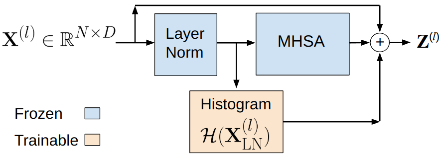

# HPT: Histogram-based Parameter-efficient Tuning
<p align="center">
  
</p>


**HPT: Histogram-based Parameter-efficient Tuning**

Amirmohammad Mohammadi, Alexandra Van Dine and Joshua Peeples

Note: If this code is used, please cite it: Amirmohammad Mohammadi, Alexandra Van Dine and Joshua Peeples. (2025, February) Peeples-Lab/HLTDNN: Initial Release (Version v1.0). 

arXiv

## Installation Prerequisites

The [`requirements.txt`](requirements.txt) file includes all the necessary packages, and the packages will be installed using:

   ```pip install -r requirements.txt```

## Demo

To get started, please follow the instructions in the [Datasets](Datasets) folder to download the DeepShip dataset.
Next, run [`demo.py`](demo.py) in Python IDE (e.g., Spyder) or command line to train, validate, and test models. 


## Inventory

```
https://github.com/Peeples-Lab/HLTDNN 

└── root directory
    ├── demo_light.py                     // Main demo file.
    ├── Demo_Parameters.py                // Parameter file for the demo.
    ├── plot_curves.py                    // Run this after the demo to view learning curves. 
    ├── feature_similarity_analysis.py    // Run this after the demo to view feature similarites, please set the parameters accordingly. 
    └── Datasets                
        ├── Get_Preprocessed_Data.py       // Resample the audio data and generate segments for the DeepShip dataset.
        └── SSDataModule.py                // Data Module for the DeepShip dataset.
        ├── ShipsEar_Data_Preprocessing.py // Generate segments for the ShipsEar dataset.
        └── ShipsEar_dataloader.py         // Data Module for the ShipsEar dataset.
        ├── Create_Combined_VTUAD.py 	   // Merge the three distinct scenarios into one for the VTUAD dataset.
        └── VTUAD_DataModule.py            // Data Module for the VTUAD dataset.
    └── Utils                     
        ├── LitModel.py                    // Lightning Module for the the model.
        ├── Network_functions.py           // Contains functions to initialize, train, and test the model.
        └── Feature_Extraction_Layer.py    // Extract and transform different features from the audio files.
        ├── LogMelFilterBank.py            // Log Mel Filter Bank.
        └── Feature_Extraction_Layer.py    // Extract and transform features from the audio files.
    └── src
    	└── models              
		├── ast_base.py            // AST Original Model
		├── ast_linear_probe.py    // AST Model Linear Probing
		├── ast_adapter.py         // AST Model with Adapter Layers
		├── RBFHistogramPooling.py // Create Histogram Layer
		└── ast_histogram.py       // AST Model with Histogram Layers

```

## License

This source code is licensed under the license found in the [`LICENSE`](LICENSE) file in the root directory of this source tree.

This product is Copyright (c) 2025 A. Mohammadi, A. Dine and J. Peeples. All rights reserved.


